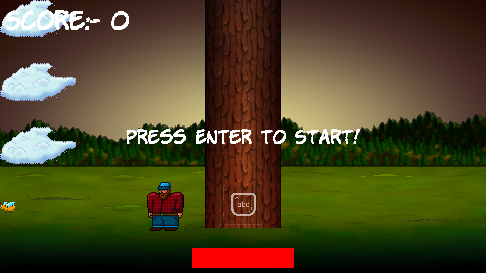

# TIMBER GAME

The classic Timber game !

Cut the tree while defending urself from the falling branches. I love it and u dare to say no !

## Installation
Just clone the repo, and run this command to build exe:-

`g++ Timber.cpp -Iinclude -Llib -lsfml-graphics -lsfml-window -lsfml-system -lsfml-audio -o Timber.exe`

### ICON
To have an icon as well, the `resource.rc` file is present including the `tree.ico` icon.

You can either build ur own object file using `windres resource.rc -o resource.o` (need windres for it) or just use the one already present !

Then the exe build command would change to :-

`g++ Timber.cpp resource.o -Iinclude -Llib -lsfml-graphics -lsfml-window -lsfml-system -lsfml-audio -o Timber.exe`